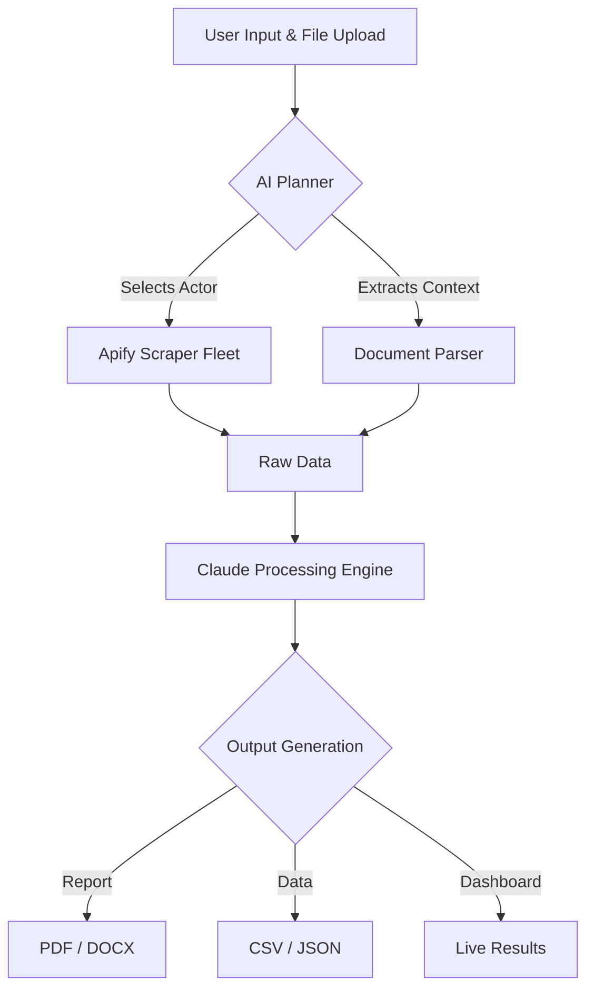

# 🔍 Handy Scrapper

> **The Intelligent Agent-Driven Data Extraction & Insight Engine**

[]()
[]()
[]()
[]()

Handy Scrapper is a state-of-the-art AI agent designed to bridge the gap between complex web data and actionable insights. By orchestrating a fleet of over 4,000 scraping actors and leveraging the cognitive power of Claude 3.5, it transforms raw web information into structured, professional reports in seconds.

---

## 🚀 Key Features

- **🧠 AI-Driven Orchestration**: Claude 3.5 intelligently selects the optimal scraping strategy (Apify Actors) based on your natural language input.
- **📄 Multi-Source Intelligence**: Seamlessly integrates uploaded documents (PDF, DOCX) to ground research in your data.
- **📊 Automated Reporting**: Generates high-fidelity professional reports in **PDF**, **DOCX**, and **CSV** formats automatically.
- **⚡ Real-time Job Tracking**: Watch your agent work through stages: *Selection* → *Extraction* → *Synthesis* → *Delivery*.
- **🌐 4000+ Scraping Capabilities**: Access specialized scrapers for LinkedIn, Instagram, Google, TripAdvisor, and more.
- **🛠️ Extensible Skill System**: Powered by a robust modular "Skills Index" that defines the agent's core capabilities.

---

## 🗺️ How It Works



---

## 🛠️ Tech Stack

### Frontend
- **Framework**: React 18 + Vite
- **Styling**: Tailwind CSS + Shadcn UI
- **Animations**: Framer Motion
- **State Management**: TanStack Query + Zustand
- **Icons**: Lucide React

### Backend & AI
- **Runtime**: Bun / Node.js
- **Brain**: Claude 3.5 (via Anthropic SDK)
- **Database**: Supabase (PostgreSQL + Real-time)
- **Extraction**: Apify SDK
- **File Processing**: pdf-lib, mammoth.js, pdf-parse

---

## ⚡ Agent Skills & Domain Expertise

The Handy Scrapper agent is equipped with specialized domain-specific skills:

- **💼 Job Market Insights**: Automated career matching, skill gap analysis, and salary benchmarking.
- **📈 Competitor Intelligence**: SWOT analysis, pricing monitoring, and strategic positioning research.
- **📍 Travel Engineering**: Itinerary generation, attraction scoring, and restaurant recommendations.
- **🔬 Deep Research**: Synthesis of large-scale web results into concise executive summaries.

---

## 📂 Project Structure

```text
insight-hub/
├── 📁 Skills/           # Integrated AI Skill Libraries & Prompts
├── 📁 server/           # Bun Worker & AI Core logic
├── 📁 src/              # React Dashboard & UI Components
│   ├── 📁 components/   # Modular Shadcn UI elements
│   ├── 📁 pages/        # Dashboard, Analysis, & Report views
│   └── 📁 lib/          # Utilities & Supabase client
├── 📁 supabase/         # Database migrations & schemas
├── 📄 package.json      # Dependencies & Scripts
└── 📄 README.md         # You are here!
```

---

## ⚙️ Getting Started

### Prerequisites
- [Bun](https://bun.sh/) or Node.js installed
- Supabase Account
- Anthropic API Key (Claude)
- Apify API Token

### Installation

1. Clone the repository
2. Install dependencies:
   ```bash
   bun install
   ```
3. Set up environment variables in `.env`:
   ```env
   VITE_SUPABASE_URL=your_url
   VITE_SUPABASE_ANON_KEY=your_key
   ANTHROPIC_API_KEY=your_key
   APIFY_TOKEN=your_token
   ```
4. Start the development server:
   ```bash
   bun dev
   ```
5. Start the AI worker:
   ```bash
   bun run worker:dev
   ```

---

## 🛡️ Future-Proof Architecture

Handy Scrapper is built with **Resiliency First** in mind:
- **Fallback Logic**: If a specialized scraper fails, the agent automatically falls back to a generalized search strategy to ensure results.
- **Schema-Agnostic Processing**: Claude's reasoning allows it to handle data from any source, regardless of the dynamic shape of the scrapers.

---

<div align="center">
  <p><strong>Handy Scrapper</strong> — Turning the web into your personal knowledge base.</p>
  <sub>made by Zenovate</sub>
</div>
